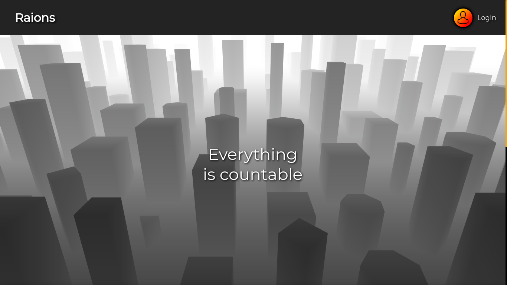
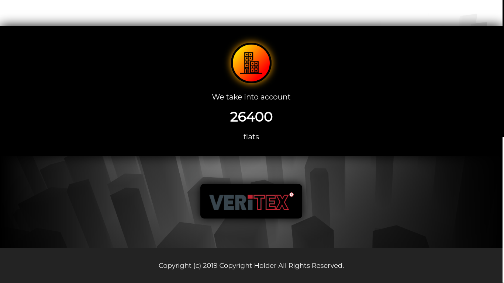
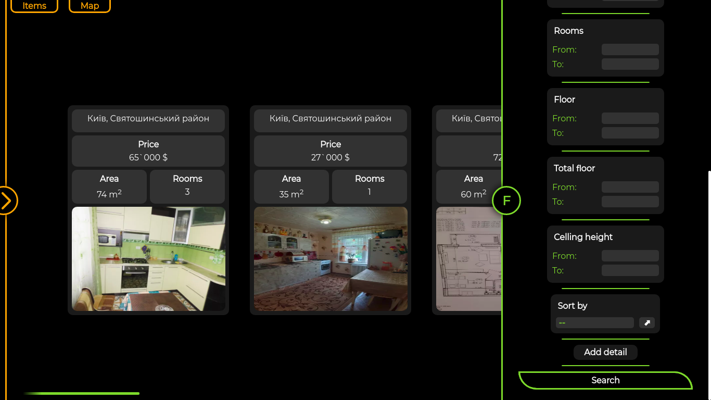
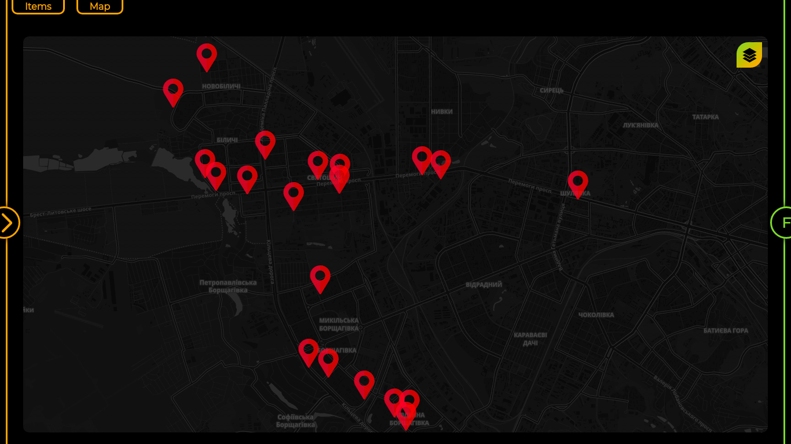
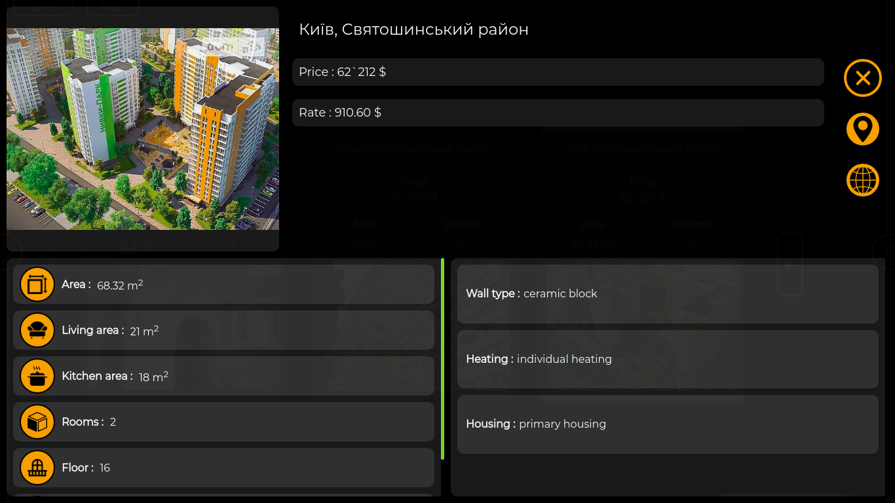

raions
======
[*raions*](http://raions.veritexgroup.com.ua/) - it's a simple Ukrainian realty estimation service.
It's main purpose is to aggregate real estate data and provide informative insights with the help of
machine learning.

Previews
--------

License
-------
This software is published under the [GNU GPL v3](LICENSE).